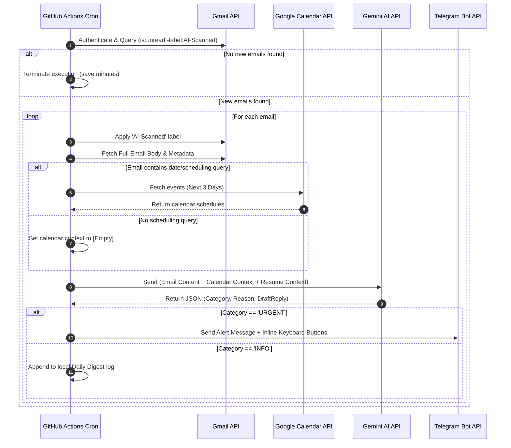
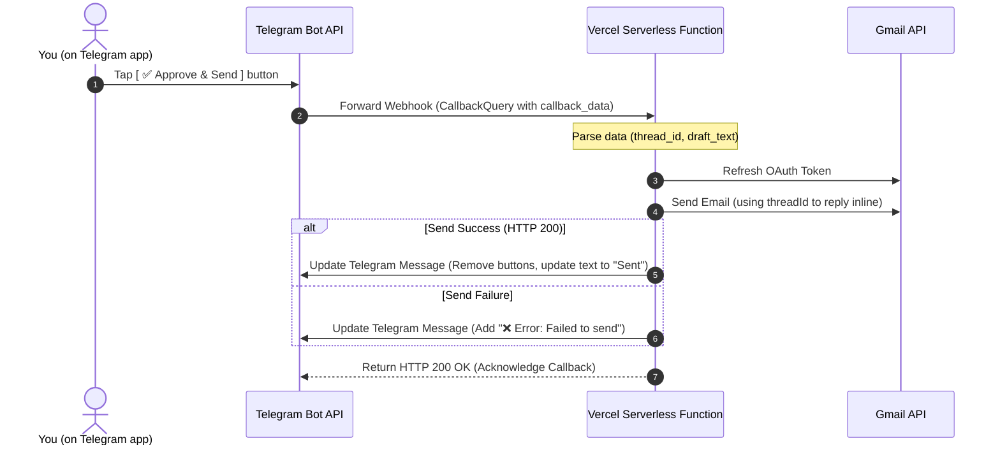

# App Flow & Workflows

This document outlines the operational workflows of the agent. There are two primary asynchronous loops:
1. **The Polling Loop (GitHub Actions):** Scans and categorizes emails.
2. **The Approval Callback Loop (Vercel):** Handles user button taps and sends the draft.

---

## 1. Flow A: The Polling Loop (Every 15 Minutes)

This flow runs headlessly in the background via GitHub Actions.

---

## 2. Flow B: The Webhook Approval Loop (Instant Action)

This flow is triggered when you tap a button in your Telegram app. The Telegram server sends a webhook request to Vercel.

---

## 3. Edge Cases & Error Flow
* **OAuth Token Expires:** If the `GOOGLE_REFRESH_TOKEN` is revoked or invalid, the script sends an emergency Telegram message: *"⚠️ Error: Gmail API disconnected. Please run local setup to renew OAuth tokens."*
* **Gemini Free Tier Exhausted:** If rate limited, the Python script catches the error, sleeps for 10 seconds, and retries. If it fails 3 times, it alerts Telegram: *"⚠️ Gemini API rate limit hit. Skipping scan. Will retry in 15 minutes."*
* **Double Clicks on Telegram:** If the user clicks `[ Approve & Send ]` twice, the serverless webhook checks if the draft was already sent (by checking the state or Telegram message text). If yes, it ignores the second click to prevent duplicate emails from being sent to the recipient.
