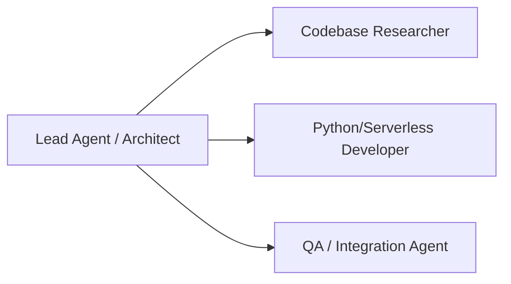

# Multi-Agent Workflow

This document describes how different specialized AI agents (or subagent processes) collaborate to build, test, and deploy this project. By dividing tasks among specialized subagents, we speed up execution and ensure high-quality code.

---

## 1. Agent Roles & Responsibilities

We define three specialized virtual agent roles to execute the implementation plan:

### 1.1 Lead Agent (Architect)
* **Objective:** Directs the overall project, maintains documentation, handles user approval checkpoints, and coordinates execution phases.
* **Outputs:** `task.md`, `walkthrough.md`, final code reviews.

### 1.2 Python/Serverless Developer (Coder)
* **Objective:** Writes clean, modular Python scripts and sets up the serverless APIs.
* **Outputs:** 
  * `check_emails.py` (Gmail scan & Gemini draft).
  * `api/telegram_webhook.py` (Vercel Serverless Function).
  * `.github/workflows/scan.yml` (GitHub Actions configuration).

### 1.3 QA / Integration Agent (Tester)
* **Objective:** Tests the endpoints, validates API scopes, mocks email data, and verifies the Telegram webhook callback.
* **Outputs:** Test scripts, mock payload generator, execution logs.

---

## 2. Collaborative Workflow

```mermaid
sequenceDiagram
    participant Lead as Lead Architect
    participant Coder as Developer Agent
    participant Tester as Tester Agent
    actor User as User (Approval)

    Lead->>User: Request approval on PRD/TRD/Plan
    User-->>Lead: Approved
    
    rect rgb(30, 30, 40)
        Note over Coder, Tester: Phase 1: Code & Unit Test
        Lead->>Coder: Build Gmail API auth & scan scripts
        Lead->>Tester: Create mock email templates & test scripts
        Coder-->>Lead: Local script ready
        Tester->>Coder: Validate script against mock emails
        Tester-->>Lead: Unit tests passed
    end

    rect rgb(40, 30, 30)
        Note over Coder, Tester: Phase 2: Webhook & Telegram Integration
        Lead->>Coder: Code Vercel function & Telegram bot setup
        Lead->>Tester: Mock Telegram callback query payloads
        Coder-->>Lead: Vercel folder ready
        Tester->>Coder: Test Vercel function locally using uvicorn/curl
        Tester-->>Lead: Integration tests passed
    end

    Lead->>User: Deployment Readiness Review
```

---

## 3. Communication Protocols
* **Context Preservation:** Subagents use structured logs in the `scratch/` directory to share state, API credentials, and test results.
* **Linting and Validation:** The developer agent must run local Python linting checks (`pylint` or `flake8` if available) before submitting code back to the parent agent.
