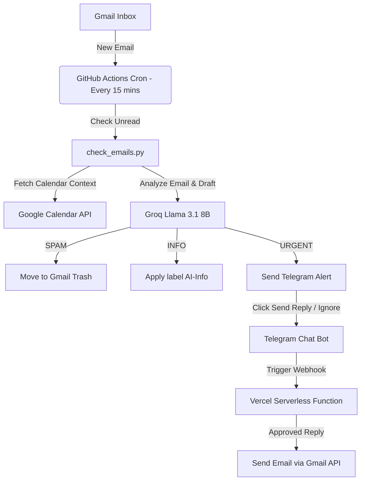

# 🤖 Personal Email AI Agent

A lightweight, secure, and fully automated AI assistant running **24/7 in the cloud** to scan your Gmail inbox, check Google Calendar availability, auto-delete SPAM, draft replies to URGENT queries, and send paged digests to your phone via Telegram.

---

## 📁 System Architecture & Flow



---

## ✨ Features

* **🧠 Smart Llama 3.1 8B (via Groq API):** Powered by Meta's highly capable model on Groq's high-speed free tier, giving you **14,400 free requests per day** (no cost, no quota blocks).
* **🗑️ Automated SPAM Cleaner:** Any email classified as `SPAM` is instantly moved to your Gmail **Trash** folder, removing it from your inbox immediately with a 30-day safety net.
* **⚡ Interactive Telegram Controls:** Tap **`Send Reply`** or **`Ignore`** directly from alerts on your phone to instantly send the drafted response via your Gmail account.
* **📅 Paged Daily Digests:** Summarizes informational updates into a clean single-sentence digest. Paged to 5 items to avoid serverless execution timeouts.
* **⏰ 24/7 GitHub Actions Cron:** Automatically polls your Gmail inbox every 15 minutes and compiles digests every night at 8:00 PM IST.

---

## 📱 Bot Commands on Telegram

Message your bot directly on Telegram to trigger these commands:

* 🔌 `/status` - Pings Vercel, Gmail, Google Calendar, and Groq APIs to verify connections.
* 🔍 `/scan` - Instantly triggers a manual scan of the most recent 2 unread emails.
* 🧹 `/clean` - Instantly trashes up to 300 promotional emails from your inbox.
* 📅 `/summary` - Compiles your daily digest of informational emails immediately.

---

## 🚀 Setup & Deployment Guide

### 1. Secret Keys Checklist
You will need to gather the following 6 keys:
1. `GOOGLE_CLIENT_ID` & `GOOGLE_CLIENT_SECRET` (OAuth 2.0 Credentials from Google Cloud Console).
2. `GOOGLE_REFRESH_TOKEN` (Generated from your OAuth login flow).
3. `TELEGRAM_BOT_TOKEN` (From Telegram's `@BotFather`).
4. `TELEGRAM_CHAT_ID` (Your Telegram User ID from `@GetIDBot`).
5. `GROQ_API_KEY` (Free key from [Groq Console](https://console.groq.com/)).
6. `STUDENT_PROFILE` (Text describing your background, college, internship goals, and desired reply tone).

---

### 2. Local Setup
1. Clone the repository.
2. Create a `.env` file in the root folder:
   ```env
   GOOGLE_CLIENT_ID=your_id
   GOOGLE_CLIENT_SECRET=your_secret
   GOOGLE_REFRESH_TOKEN=your_token
   TELEGRAM_BOT_TOKEN=your_bot_token
   TELEGRAM_CHAT_ID=your_chat_id
   GROQ_API_KEY=your_groq_key
   STUDENT_PROFILE=your_profile_details
   ```
3. Install dependencies:
   ```bash
   pip install -r requirements.txt
   ```
4. Run a manual scan:
   ```bash
   python check_emails.py
   ```

---

### 3. Deploy Serverless Webhook (Vercel)
1. Link your folder to Vercel:
   ```bash
   vercel
   ```
2. Go to Vercel settings and add the 6 secrets above as Environment Variables.
3. Deploy to production:
   ```bash
   vercel --prod
   ```
4. Set your Telegram Bot webhook URL by executing this in your browser/terminal:
   ```bash
   https://api.telegram.org/bot<TELEGRAM_BOT_TOKEN>/setWebhook?url=<YOUR_VERCEL_PRODUCTION_URL>/api/telegram_webhook
   ```

---

### 4. 24/7 Automatic Scheduler (GitHub Actions)
1. Push this code to a **private** GitHub repository.
2. Go to your repository settings page: **Settings** -> **Secrets and variables** -> **Actions**.
3. Add the 6 secret variables listed above as **Repository Secrets**.
4. The workflow in `.github/workflows/scan.yml` will now automatically scan your inbox every 15 minutes!
