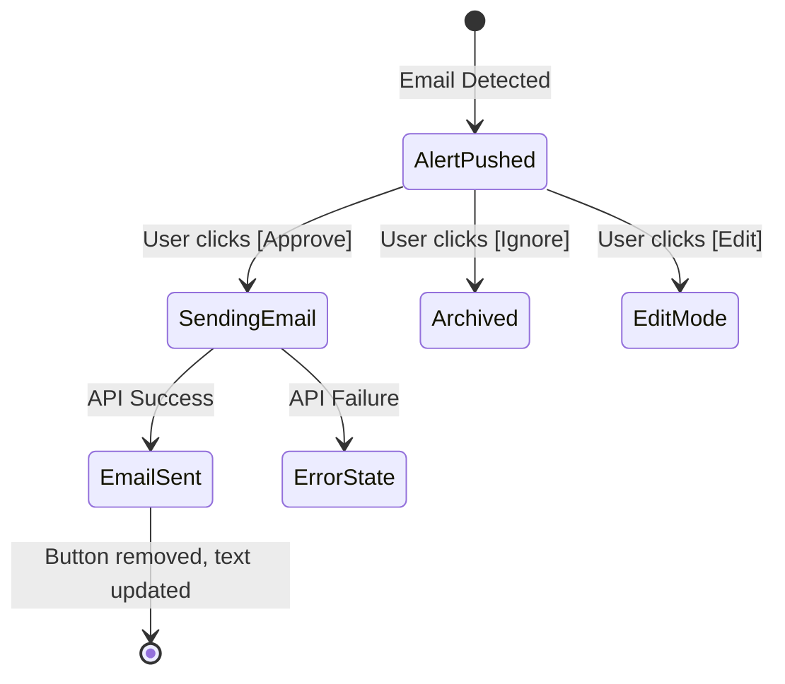

# UI/UX Design — Telegram Bot Interface

Since our agent runs headlessly, the **User Interface (UI)** and **User Experience (UX)** live entirely inside the Telegram app. The design prioritizes scanning speed, readability, and immediate action.

---

## 1. Message Layout Templates

### 1.1 Urgent Email Alert (Immediate Push Notification)
When a high-priority email is scanned, this structured message is pushed. It uses bold headings, markdown spacing, and a code block to separate the draft.

```text
🔴 *URGENT EMAIL DETECTED*

📧 *From:* placements@college.edu.in
📌 *Subject:* Invitation: Mock Interview Schedule - Monday
⏰ *Received:* Today, 10:15 AM

📖 *AI Summary:*
The Placement Cell invites you to confirm your slot for the mock interview this coming Monday.

🗓️ *Calendar Check:*
⚠️ *Conflict found:* You have a class "Advanced Algorithms" on Monday 10:00 AM - 11:30 AM.
✅ *Free slot suggested:* Monday, 2:00 PM onwards.

📝 *Drafted Reply:*
```text
Dear Placement Coordinator,

Thank you for the invitation. I would like to schedule my mock interview slot on Monday at 2:00 PM, as I have a lecture in the morning.

Best regards,
Aravind
```

```
[ ✅ Approve & Send ]   [ ❌ Ignore & Archive ]
[ ✏️ Edit Draft ]
```

---

### 1.2 Daily Digest (Daily at 8:00 PM)
For emails categorized as `INFO` (no instant reply needed), the agent groups them into a clean, bulleted list.

```text
📅 *DAILY DIGEST - 17 July 2026*

Total emails scanned: *47* (42 spam ignored)

🔹 *Academic Office* - CSE-5 Sem Timetable Update
└ AI Summary: Final exam dates are out; first exam is on 3rd November.

🔹 *Google Developer Student Club* - Hackathon Shortlist
└ AI Summary: Your team has been shortlisted for round 2. Submit abstract by Sunday.

🔹 *GitHub* - Security alert for Python repo
└ AI Summary: Action required to patch dependencies.
```

---

## 2. Interaction & State Transitions

When a user taps an inline button, the Telegram interface updates dynamically to prevent duplicate actions.



### 2.1 State: "Approve & Send" Clicked
The moment you tap `[ ✅ Approve & Send ]`, the bot immediately updates the message to indicate it is processing. Once sent, the buttons are removed and the text is updated:

```text
📬 *STATUS: Email Sent!*

📧 *Sent To:* placements@college.edu.in
✅ *Status:* Success (API 200)
⏰ *Sent At:* Today, 10:17 AM

*Original Draft Sent:*
"Dear Placement Coordinator, ..."
```

---

## 3. Bot Commands (`/` Commands)
You can interact with your agent by sending these commands directly to the bot chat:

*   `/start` - Greets you and checks if your Google OAuth refresh token and Gemini keys are active.
*   `/status` - Returns connection checks for:
    *   `Gmail API:` Connected (token valid)
    *   `Calendar API:` Connected
    *   `Gemini API:` Connected (free tier active)
*   `/summary` - Triggers a summary of the unread emails from the last 24 hours immediately.
*   `/pause` - Temporarily disables Telegram alerts for 1, 4, or 12 hours (useful during exams or sleeping).
